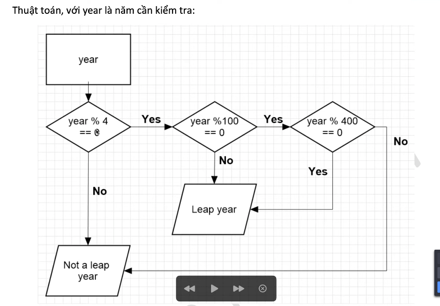

Học Kotlin

[Link video](https://www.youtube.com/playlist?list=PLE1qPKuGSJaDeoSw8aW4N8FOM23Fz5qfY)

https://github.com/thantrieu/LearnKotlin

---

# video 4

thế nào là năm nhuận?

- nếu chia hết cho 4 -> đó là năm nhuận
- nếu không chia hết cho 4 -> không phải là năm nhuận